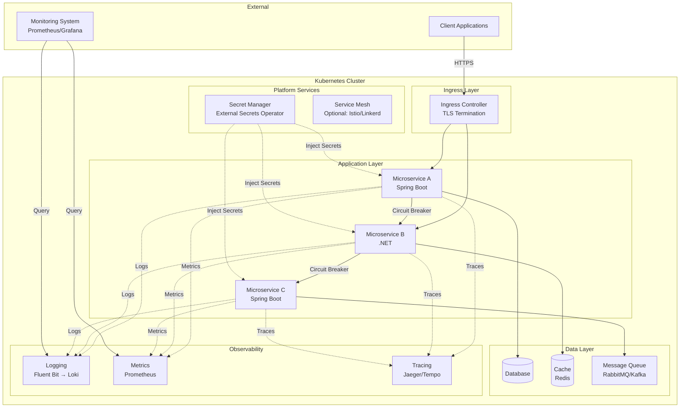
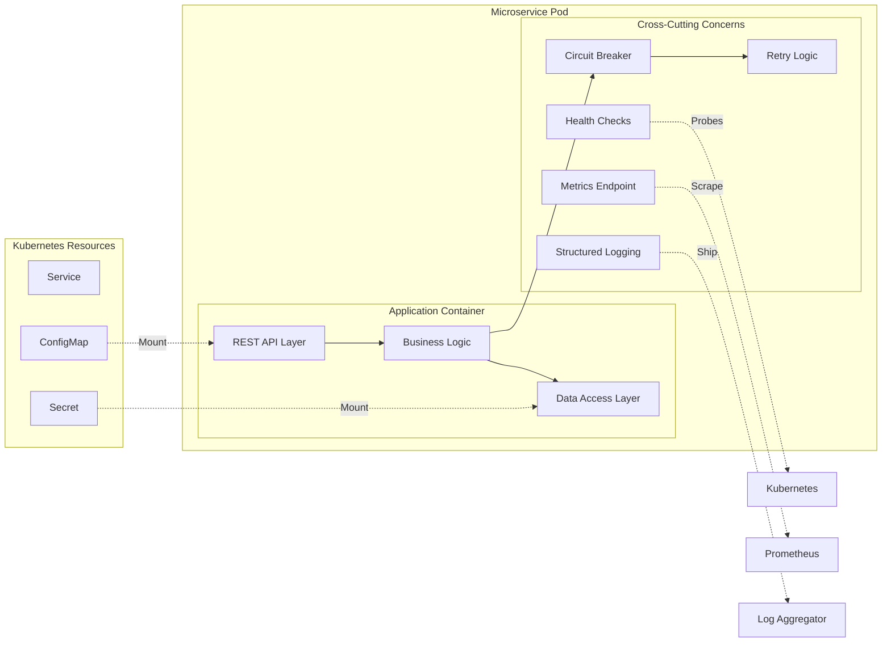
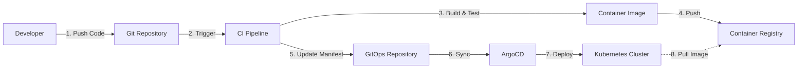
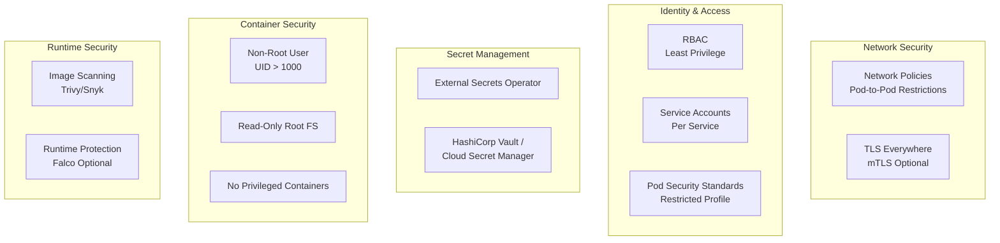
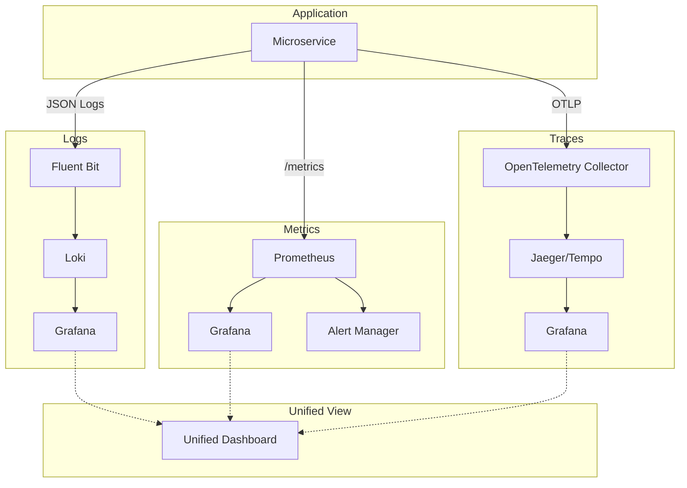
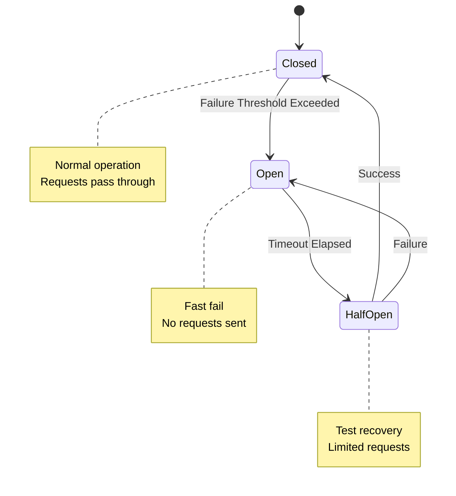

# CNMRF Reference Architecture

## Overview

This document defines the reference architecture for cloud-native microservices built using CNMRF patterns.

**Alignment to Project Outline:**  
Implements Section 5 deliverable: "Architecture Guidance - Reference architecture docs, Mermaid diagrams, NFR baselines"

## Architecture Principles

Based on Project Outline Section 7:

1. **Platform-Neutral First** - Kubernetes baseline, no vendor lock-in
2. **Security by Default** - Non-root containers, least-privilege RBAC
3. **Observability Built-In** - Structured logging, metrics, tracing
4. **Resiliency as Baseline** - Circuit breakers, retries, graceful shutdown
5. **GitOps-Ready** - Declarative manifests, config as code

## High-Level Architecture

## Component Architecture

### Microservice Internal Architecture

## Deployment Architecture

### GitOps Flow

## Security Architecture

### Defense in Depth

## Observability Architecture

### Three Pillars

## Resiliency Patterns

### Circuit Breaker Pattern

## Technology Stack

### Core Technologies

| Layer | Technology | Rationale |
|-------|-----------|-----------|
| **Container Runtime** | Docker / containerd | Industry standard, OCI-compliant |
| **Orchestration** | Kubernetes 1.28+ | Platform-neutral baseline |
| **Service Framework (Java)** | Spring Boot 3.2+ | Production-ready, comprehensive ecosystem |
| **Service Framework (.NET)** | .NET 8+ | Modern, high-performance, cross-platform |
| **API Documentation** | OpenAPI 3.0 | Standard API specification |
| **Metrics** | Prometheus | CNCF standard, Kubernetes-native |
| **Logging** | JSON structured logs | Machine-readable, queryable |
| **Tracing** | OpenTelemetry | Vendor-neutral, future-proof |
| **Circuit Breaker (Java)** | Resilience4j | Lightweight, functional |
| **Circuit Breaker (.NET)** | Polly | Industry standard for .NET |
| **GitOps** | ArgoCD | Declarative, Kubernetes-native |
| **Helm** | Helm 3+ | Package management for Kubernetes |

### Optional/Cloud-Specific

| Component | Options | Notes |
|-----------|---------|-------|
| **Ingress** | NGINX, Traefik, AWS ALB, Azure App Gateway | Choose based on platform |
| **Service Mesh** | Istio, Linkerd, AWS App Mesh | Optional, adds complexity |
| **Secret Management** | Vault, AWS Secrets Manager, Azure Key Vault, GCP Secret Manager | Choose based on platform |
| **Container Registry** | Docker Hub, ECR, ACR, GCR, Harbor | Choose based on platform |

## Multi-Cloud Compatibility

### Kubernetes Distribution Support

CNMRF templates work on:

- **AWS EKS** - Elastic Kubernetes Service
- **Azure AKS** - Azure Kubernetes Service  
- **Google GKE** - Google Kubernetes Engine
- **Red Hat OpenShift** - Enterprise Kubernetes platform
- **On-Premises** - Vanilla Kubernetes, Rancher, etc.

### Platform-Specific Extensions

Cloud-specific features (e.g., AWS ALB Ingress, Azure Application Gateway) are **optional extensions**, not core requirements.

Core templates use:
- Standard Kubernetes Ingress
- Generic PersistentVolumeClaims
- Standard LoadBalancer services

## Non-Functional Requirements

See [NFR Baseline](nfr-baseline.md) for detailed requirements.

### Summary

| Category | Baseline Requirement |
|----------|---------------------|
| **Availability** | 99.9% uptime (3 nines) |
| **Performance** | P95 latency < 200ms for API calls |
| **Scalability** | Horizontal scaling via HPA |
| **Security** | Non-root, RBAC, secret management |
| **Observability** | Logs, metrics, traces for all services |
| **Resiliency** | Circuit breakers, retries, graceful shutdown |

## Design Decisions

Key architectural decisions are documented in ADRs:

- [ADR-0001: Authentication Approach](../adr/0001-authentication-approach.md)
- [ADR-0002: Observability Stack](../adr/0002-observability-stack.md)
- [ADR-0003: Resiliency Patterns](../adr/0003-resiliency-patterns.md)

## Implementation Guidance

### For New Services

1. Choose service template (`microservice-springboot` or `microservice-dotnet`)
2. Review this reference architecture
3. Implement business logic following the component architecture
4. Deploy using Helm chart from `infra-helm` template
5. Set up GitOps using `gitops-argocd` template

### For Existing Services

1. Review NFR baseline and identify gaps
2. Implement missing observability (health checks, metrics, logging)
3. Add resiliency patterns (circuit breakers, retries)
4. Containerize with non-root user
5. Create Helm chart following `infra-helm` template
6. Migrate to GitOps deployment

## Validation

Services should validate against:

- ✅ All health check endpoints respond correctly
- ✅ Metrics endpoint exposes Prometheus-compatible metrics
- ✅ Logs are structured JSON
- ✅ Container runs as non-root user
- ✅ Resource limits are defined
- ✅ Circuit breakers are configured
- ✅ Graceful shutdown is implemented

## References

- [Kubernetes Documentation](https://kubernetes.io/docs/)
- [12-Factor App](https://12factor.net/)
- [CNCF Cloud Native Definition](https://github.com/cncf/toc/blob/main/DEFINITION.md)
- [OpenTelemetry](https://opentelemetry.io/)
- [Prometheus Best Practices](https://prometheus.io/docs/practices/)

---

**Next Steps:**
1. Review [NFR Baseline](nfr-baseline.md)
2. Study [ADRs](../adr/README.md) for decision rationale
3. Explore [Service Templates](../../templates/README.md)

---

Copyright 2026 Chaitanya Bharath Gopu. Licensed under the Apache License, Version 2.0.
