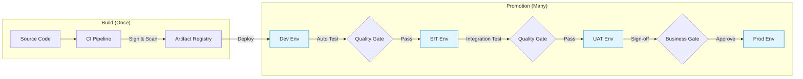

# Build-Once, Deploy-Many Promotion Model

## 1. Promotion Flow

## 2. Artifact Immutability

**Rule:** Never rebuild the artifact between environments.
*   **Bad:** Building a `dev.jar` and then a `prod.jar`.
*   **Good:** Building `service-v1.jar` and deploying it to Dev, then moving *that exact file* to Prod.

## 3. Configuration Management

Configuration is injected at runtime, not baked into the image.

*   **ConfigMaps:** Non-sensitive data (URLs, Feature Flags).
*   **Secrets:** Sensitive data (DB Passwords, API Keys) via External Secret Store (Vault).

## 4. Rollback Strategy

*   **Automatic:** If a deployment fails health checks (Readiness Probe) within X minutes, the platform (Helm/Argo) automatically rolls back to the previous revision.
*   **Manual:** A "Revert" commit in the GitOps config repo triggers a rollback.

---

Copyright 2026 Chaitanya Bharath Gopu. Licensed under the Apache License, Version 2.0.
