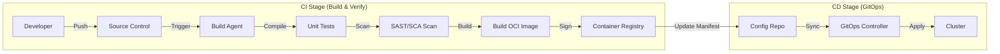

# CI/CD Reference Architecture

## 1. Pipeline Architecture

CNMRF advocates for a distinct separation between Continuous Integration (CI) and Continuous Deployment (CD), utilizing a GitOps pattern for the latter.

### End-to-End Flow



## 2. Pipeline Stages

### A. Continuous Integration (CI)
*   **Trigger:** Commit to feature branch (PR) or trunk (main).
*   **Build:** Compile code (Maven/Gradle for Java, `dotnet build` for .NET).
*   **Test:** Execute unit tests and mock-integration tests. Publish coverage.
*   **Security:**
    *   **SAST:** Static analysis of source code.
    *   **SCA:** Dependency vulnerability check (OWASP Dependency Check).
    *   **Container Scan:** Vulnerability scan of the base image.
*   **Artifact:** Build immutable OCI images. Tag with commit SHA (never `latest`).
*   **Publish:** Push signed image to Registry.

### B. Continuous Deployment (CD)
*   **Pattern:** GitOps (Pull-based).
*   **Mechanism:** Update Kubernetes manifests (Helm/Kustomize) in a separate Config Repo.
*   **Sync:** GitOps controller (ArgoCD/Flux) detects drift and applies state.
*   **Promotion:** Promotion is a Merge Request moving specific image tags from `dev` folder to `prod` folder in the Config Repo.

## 3. Spring Boot vs .NET Parity

| Feature | Spring Boot Pattern | .NET Pattern |
| :--- | :--- | :--- |
| **Build** | Maven / Gradle Wrapper | `dotnet publish` |
| **Artifact** | Jib or Dockerfile | Dockerfile |
| **Base Image**| Distroless Java or Eclipse Temurin | CBL-Mariner or Ubuntu Chiseled |
| **Config** | `application.yml` via ConfigMap | `appsettings.json` via ConfigMap |

## 4. Reference Snippets

### Generic Pipeline (YAML Concept)

```yaml
stages:
  - build
  - test
  - security
  - publish

build_job:
  stage: build
  script:
    # Build wrapper handles MVN or Dotnet
    - ./build-wrapper.sh
    # Save artifacts
    - docker build -t cnmrf/service:${CI_COMMIT_SHA} .

security_job:
  stage: security
  script:
    - trivy image cnmrf/service:${CI_COMMIT_SHA}
```

### GitOps Application (ArgoCD Concept)

```yaml
apiVersion: argoproj.io/v1alpha1
kind: Application
metadata:
  name: cnmrf-service-prod
spec:
  project: default
  source:
    repoURL: https://github.com/org/cnmrf-config.git
    targetRevision: HEAD
    path: envs/prod/cnmrf-service
  destination:
    server: https://kubernetes.default.svc
    namespace: prod
```

---

Copyright 2026 Chaitanya Bharath Gopu. Licensed under the Apache License, Version 2.0.
