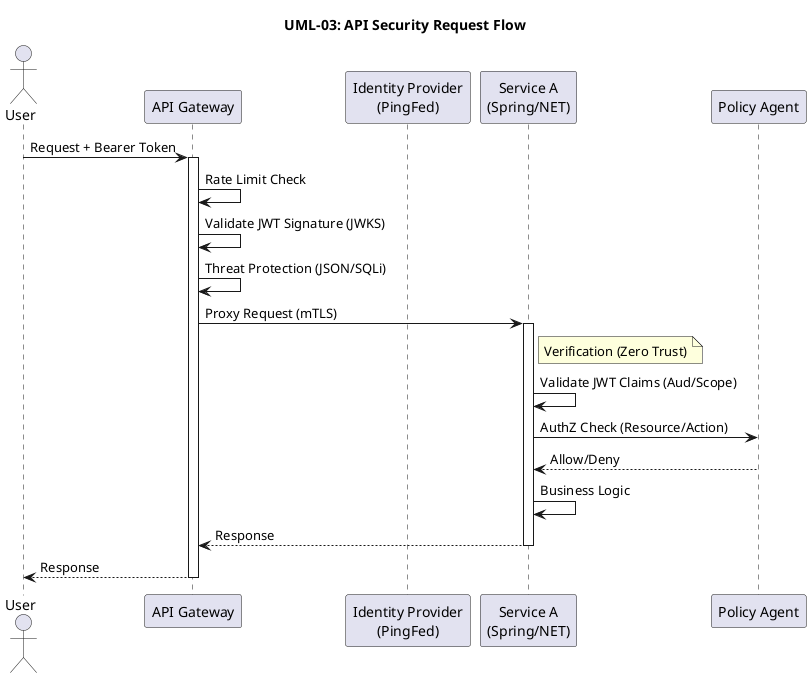
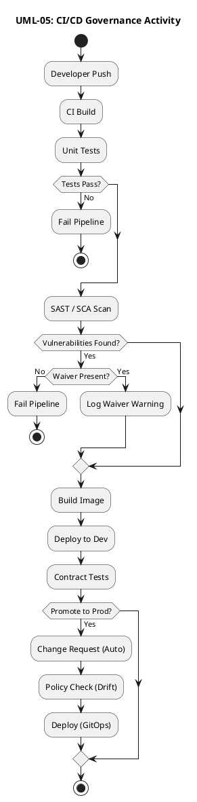

# UML Diagram Source (PlantUML)

## UML-03: API Security Flow

```plantuml
@startuml
title UML-03: API Security Request Flow
actor User
participant "API Gateway" as GW
participant "Identity Provider\n(PingFed)" as IDP
participant "Service A\n(Spring/NET)" as Svc
participant "Policy Agent" as OPA

User -> GW: Request + Bearer Token
activate GW
GW -> GW: Rate Limit Check
GW -> GW: Validate JWT Signature (JWKS)
GW -> GW: Threat Protection (JSON/SQLi)

GW -> Svc: Proxy Request (mTLS)
activate Svc
note right of Svc: Verification (Zero Trust)
Svc -> Svc: Validate JWT Claims (Aud/Scope)
Svc -> OPA: AuthZ Check (Resource/Action)
OPA --> Svc: Allow/Deny

Svc -> Svc: Business Logic
Svc --> GW: Response
deactivate Svc

GW --> User: Response
deactivate GW
@enduml
```

## UML-05: CI/CD & Governance

```plantuml
@startuml
title UML-05: CI/CD Governance Activity
start
:Developer Push;
:CI Build;
:Unit Tests;
if (Tests Pass?) then (No)
  :Fail Pipeline;
  stop
endif

:SAST / SCA Scan;
if (Vulnerabilities Found?) then (Yes)
  if (Waiver Present?) then (No)
    :Fail Pipeline;
    stop
  else (Yes)
    :Log Waiver Warning;
  endif
endif

:Build Image;
:Deploy to Dev;
:Contract Tests;

if (Promote to Prod?) then (Yes)
  :Change Request (Auto);
  :Policy Check (Drift);
  :Deploy (GitOps);
endif

stop
@enduml
```

---

Copyright 2026 Chaitanya Bharath Gopu. Licensed under the Apache License, Version 2.0.
