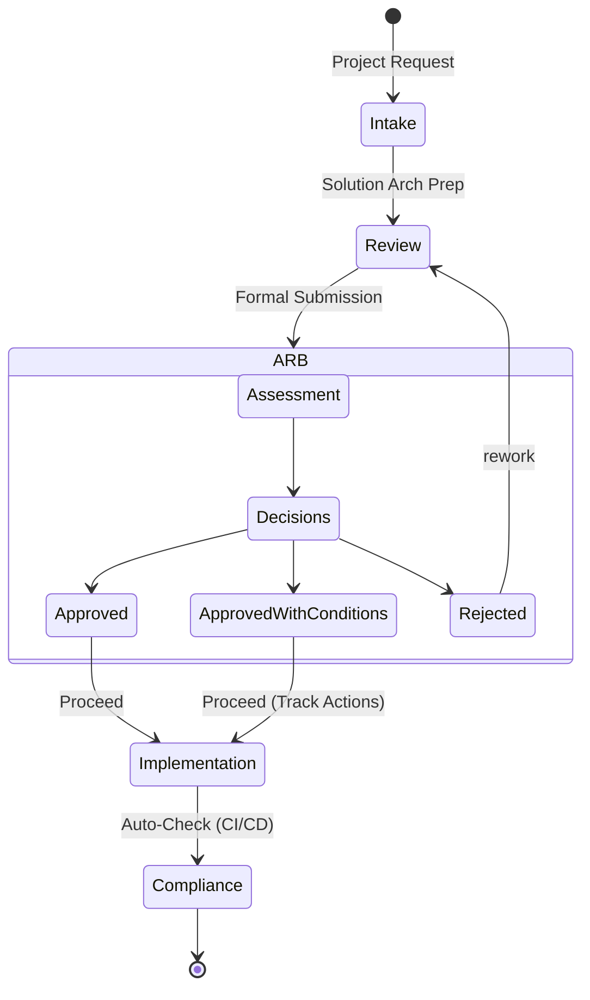

# Architecture Governance Operating Model

## 1. Architecture Review Board (ARB)

**Mission:** To ensure that technology solutions align with enterprise principles, reduce technical debt, and manage risk securely.

**Cadence:** Weekly (e.g., Tuesday 10:00 AM) or Async via Pull Request.

**Decision Rights:**
*   **Approve:** Solution may proceed to build.
*   **Approve with Conditions:** Proceed, but must remediate specific items before Go-Live.
*   **Reject:** Solution fundamentally misalignment; must rework.
*   **Defer:** Insufficient information provided.

## 2. Roles & Responsibilities (RACI)

| Role | Responsibility |
| :--- | :--- |
| **Enterprise Architect** | **Accountable** for Principles, Standards, and Governance Process. Chairs ARB. |
| **Solution Architect** | **Responsible** for creating designs, submitting ADRs, and ensuring project compliance. |
| **Security Architect** | **Consulted** on threat models and identity patterns. **Veto** right on security risks. |
| **Product Owner** | **Informed** of architecture decisions and impacts on timeline/cost. |
| **SRE / Platform** | **Consulted** on operability, observability, and infrastructure feasibility. |

## 3. Review Process

## 4. Waiver Process

If a solution cannot meet a standard (e.g., "Must use OAuth2"), a **Waiver** is required.

*   **Temporary Waiver:** Valid for X months. Must have a remediation plan and sunset date.
*   **Permanent Waiver:** Rare. Used for verified legacy constraints (e.g., "Mainframe CICS integration").

---

Copyright 2026 Chaitanya Bharath Gopu. Licensed under the Apache License, Version 2.0.
