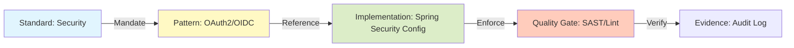

# Standards & Principles Catalog

## 1. Architecture Principles

1.  **Cloud-Native First:** Design for automation, elasticity, and failure recovery.
2.  **API First:** Define contracts (OpenAPI) before code. Treat APIs as products.
3.  **Zero Trust:** Authenticate and authorize every request. No implicit trust zones.
4.  **Loose Coupling:** Services strictly encapsulated. Share schema, not databases.
5.  **Buy over Build:** Prefer managed services or open-source libraries over custom frameworks.
6.  **Secure by Design:** Security is a requirement, not a wrapper. Shift left.
7.  **Data Sovereignty:** Systems of Record are single sources of truth.
8.  **Avoid Vendor Lock-In:** Use open standards (OIDC, SQL, Kafka protocol) to maintain portability.

## 2. Standards Catalog (Building Blocks)

| Domain | Standard | Status | Guidance |
| :--- | :--- | :--- | :--- |
| **Identity** | OAuth2 / OIDC | **Mandatory** | PingFederate as IdP. |
| **API Style** | REST (JSON) | **Mandatory** | Use Problem Details for errors. |
| **Messaging** | Kafka Protocol | **Recommended** | For high-volume eventing. |
| **Queueing** | JMS / AMQP | **Allowed** | For transactional command queues. |
| **Database** | Postgres / SQL | **Recommended** | Default choice for relational data. |
| **Container** | OCI Images | **Mandatory** | Dockerfile builds, scanned via Trivy. |
| **Orchestrator**| Kubernetes | **Mandatory** | Target deployment platform. |

## 3. Reference Architecture Usage

Implementation teams **must** start with the CNMRF Reference Templates. Deviations from the reference architecture require an Architecture Decision Record (ADR) justifying the change.

---

Copyright 2026 Chaitanya Bharath Gopu. Licensed under the Apache License, Version 2.0.
