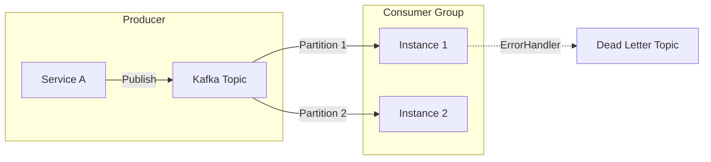
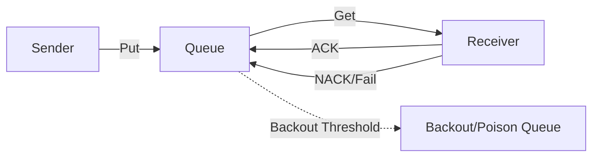

# Messaging & Integration Patterns

## 1. Event-Driven Architecture (Kafka)

**Intent:** Asynchronous decoupling of producers and consumers. Real-time stream processing.



### Key Considerations
*   **Partitioning:** Use specific keys (e.g., CustomerID) to guarantee ordering.
*   **Consumer Groups:** Scale consumption by adding instances up to the number of partitions.
*   **Idempotency:** Consumers must handle duplicate messages gracefully.

**Spring Boot (Snippet)**
```yaml
spring:
  kafka:
    consumer:
      group-id: cnmrf-group
      auto-offset-reset: earliest
      enable-auto-commit: false # Manual Ack preferred
```

**.NET (Snippet)**
```csharp
// MassTransit / Kafka
services.AddMassTransit(x => {
    x.UsingKafka((context, k) => {
        k.Host("localhost:9092");
        k.TopicEndpoint<OrderEvent>("order-events", "cnmrf-group", e => {
             e.ConfigureConsumer<OrderConsumer>(context);
        });
    });
});
```

## 2. Command/Queue Architecture (MQ)

**Intent:** Point-to-point reliable delivery for transactional commands.



### Key Considerations
*   **At-Least-Once:** Assume message might be delivered twice.
*   **Poison Messages:** Always configure a backout queue to prevent infinite retry loops.
*   **Strict Ordering:** Only possible with single consumer or exclusive grouping (scalability bottleneck).

---

Copyright 2026 Chaitanya Bharath Gopu. Licensed under the Apache License, Version 2.0.
