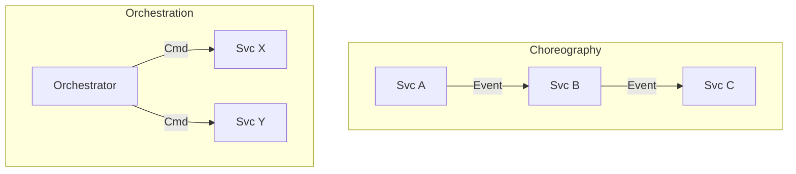

# Enterprise Integration Patterns

## 1. Strangler Fig Pattern

**Intent:** Incrementally migrate a legacy system by gradually replacing specific pieces of functionality with new microservices.
**Usage:** Use specialized routing (Ingress/Gateway) to divert traffic for specific paths (e.g., `/api/v2/orders`) to the new service while defaulting others back to the monolith.

## 2. Anti-Corruption Layer (ACL)

**Intent:** Isolate the new domain model from the legacy model.
**Usage:** Implement a translation layer (adapter) that converts legacy concepts (e.g., COBOL copybook/XML) into the modern canonical JSON model. Preventing "leaky abstractions."

## 3. Backend for Frontend (BFF)

**Intent:** Provide a tailored API experience for specific client types (Mobile vs Web).
**Usage:** Create a dedicated orchestration service that aggregates calls for the Web UI, and a separate one for Mobile, optimizing payload size and chatty interactions.

## 4. Saga Patterns

**Intent:** Manage distributed transactions across microservices without two-phase commit (2PC).

*   **Choreography:** Event-based. Each service listens for events and reacts. Decoupled but harder to track workflow state.
*   **Orchestration:** Central controller service commands participants. Clear state but tighter coupling.

## 5. Event-Carried State Transfer

**Intent:** Reduce coupling and sync calls by replicating necessary read-state via events.
**Usage:** Service B publishes "UserUpdated"; Service A consumes it and updates its local "UserCache" table.

---

Copyright 2026 Chaitanya Bharath Gopu. Licensed under the Apache License, Version 2.0.
