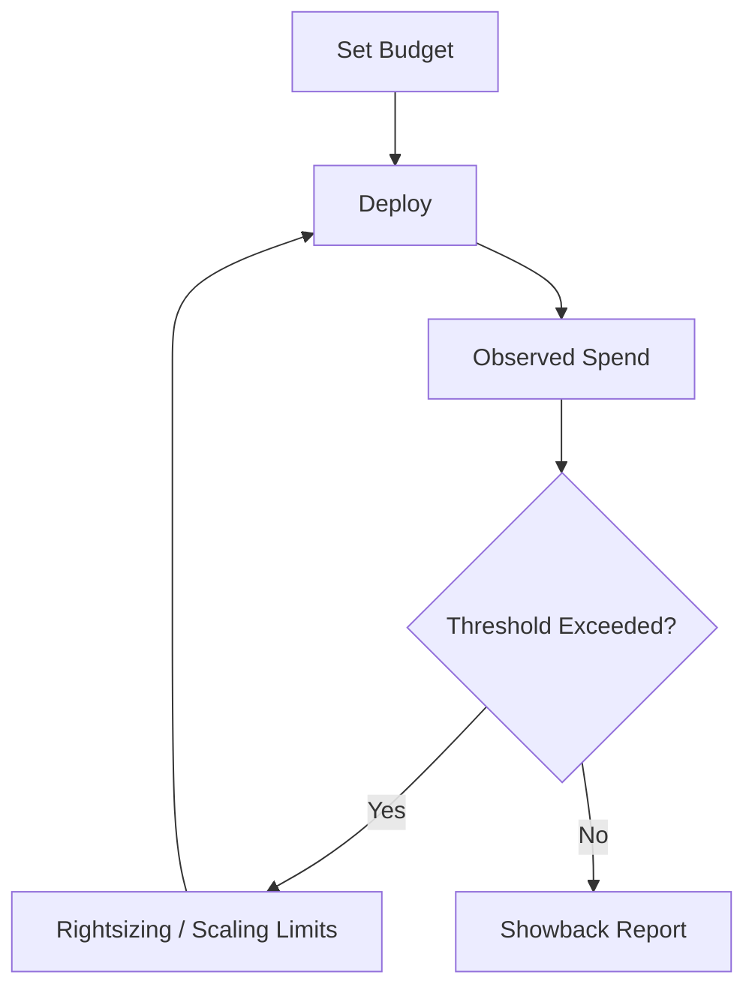

# FinOps & Cost Optimization Patterns

## 1. Low-Cost Architecture Principles

*   **Build Once, Deploy Many:** Saves CI build minutes and storage.
*   **Scale to Zero:** Use KEDA or Serverless for non-prod environments (Dev/SIT) to pay $0 at night.
*   **Spot Instances:** Use interruptible VMs for stateless worker nodes (batch processing).

## 2. Environment Size Policy

| Environment | Replicas | CPU / RAM | Availability | Cost Factor |
| :--- | :--- | :--- | :--- | :--- |
| **Dev** | 1 (Spot) | 0.1 vCPU / 256MB | Zone-Local | $ |
| **SIT** | 1-2 | 0.2 vCPU / 512MB | Zone-Local | $$ |
| **UAT** | 2 (Burstable)| 0.5 vCPU / 1GB | Multi-Zone | $$$ |
| **Prod** | 3+ (Reserved)| 1.0 vCPU / 2GB | Multi-Region | $$$$$ |

## 3. Cost Governance Loop

## 4. Storage Optimization

*   **Lifecycle Rules:** Move logs/backups to "Cold Storage" (Glacier/Archive) after 30 days.
*   **Ephemeral:** Use ephemeral storage for temp files in Dev.

---

Copyright 2026 Chaitanya Bharath Gopu. Licensed under the Apache License, Version 2.0.
