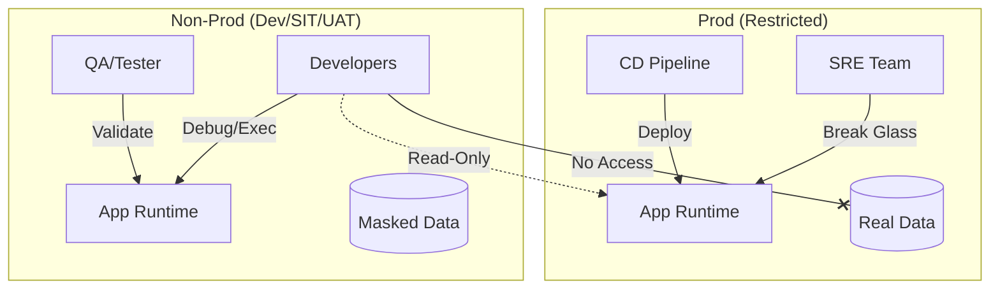

# Environment Definitions

## 1. Environment Strategy

CNMRF mandates a standard progression of environments to ensure stability and security.

### A. Local (Workstation)
*   **Purpose:** Development, debugging, and unit testing.
*   **Access:** Developer (Admin).
*   **Data:** Mocked / In-memory (H2/SQLite). No real data.
*   **Security:** Minimal (None or Self-Signed).
*   **Observability:** Console logs.

### B. Dev (Development)
*   **Purpose:** Integration of individual microservices. "Works on my machine" validator.
*   **Access:** Developers (Read/Write/Exec).
*   **Data:** Synthetic / Generated.
*   **Security:** Relaxed AuthN (Mock IdP allowed).
*   **Gate:** Passing Unit Tests & Static Analysis.

### C. SIT (System Integration Test)
*   **Purpose:** End-to-end testing of the complete system landscape. Connectivity checks.
*   **Access:** QA/SDET (Read/Write), Devs (Read-Only).
*   **Data:** Masked / Anonymized dump from Prod (Strictly PII-scrubbed).
*   **Security:** Prod-like (Real IdP, mTLS enforced).
*   **Gate:** Passing Contract Tests & Smoke Tests.

### D. UAT (User Acceptance Test)
*   **Purpose:** Business validation and feature sign-off.
*   **Access:** Business Users, Product Owners.
*   **Data:** High-fidelity Masked Data (Production volume).
*   **Security:** Prod-equivalent.
*   **Gate:** Passing Integration & Performance Baseline.

### E. Prod (Production)
*   **Purpose:** Serving live customer traffic.
*   **Access:** No Humans (GitOps only). SRE (Break-glass Read-Only).
*   **Data:** Real Customer Data (Encrypted).
*   **Security:** Full Zero Trust (WAF, mTLS, Strict Policies).
*   **Gate:** Application Security Sign-off, Business Approval, CAB.

## 2. Access Boundary Model

---

Copyright 2026 Chaitanya Bharath Gopu. Licensed under the Apache License, Version 2.0.
