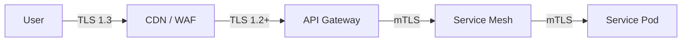

# API Security Standards

## 1. Security Layers



## 2. Gateway Controls (North-South)

The Gateway is the enforcement point for "Global Policy."

*   **OAuth check:** Validate Access Token signature (JWT) via JWKS.
*   **Quota:** Enforce business tier rate limits (e.g., 1000 req/min).
*   **Threats:** JSON/XML Bomb detection, SQLi regex filters.

### Pseudocode Policy (Generic)
```
Policy "Standard-Entry":
  Step 1: Check-WAF-Tags
  Step 2: Verify-JWT (Issuer=PingFed, Alg=RS256)
  Step 3: Spike-Arrest (Rate=100ps)
  Step 4: Quota (Count=1000, Interval=1min)
```

## 3. Service Controls (East-West)

Services must **never** assume they are safe just because they are behind a gateway.

*   **mTLS:** Enforced by Sidecar (Istio) or Framework (Spring Security).
*   **Authorization:** Validate JWT `scope` (e.g., `read:orders`).
*   **Input Validation:** Strict type checking on all fields.

## 4. Configuration Examples

### PingFederate Integration
*   **Issuer:** `https://idp.example.com`
*   **JWKS URL:** `https://idp.example.com/pf/JWKS`
*   **Audience:** Must match the Service ID (e.g., `api://order-service`).

### Apigee (Conceptual)
```xml
<OAuthV2 name="Verify-Token">
  <Operation>VerifyAccessToken</Operation>
  <PublicKey>
    <JWKS uri="https://idp.example.com/pf/JWKS"/>
  </PublicKey>
</OAuthV2>
```

### IBM DataPower (Conceptual)
```
aaa-policy "OIDC-Protection":
  extract-identity: oauth-bearer
  validate-token: external-jwks
  map-identity: cn-from-token
```

---

Copyright 2026 Chaitanya Bharath Gopu. Licensed under the Apache License, Version 2.0.
