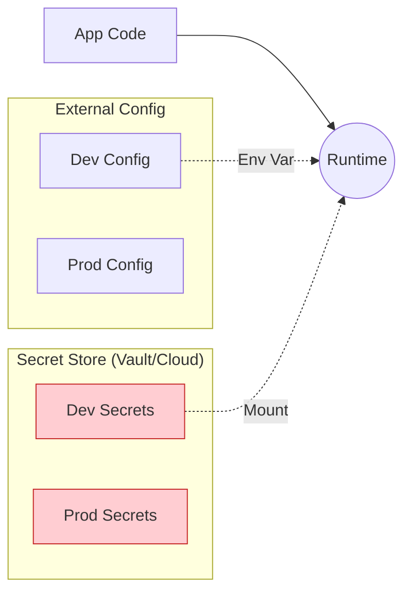

# Environment Security Controls

## 1. Identity & Access

| Control | Dev / SIT | UAT / Prod |
| :--- | :--- | :--- |
| **Authentication** | Mock IdP or Dev OAuth Client | Production PingFederate (MFA required) |
| **mTLS** | Optional / Permissive | **Mandatory / Strict** (Zero Trust) |
| **Developer Access**| Exec into Pods allowed | **None** (Read-Only Logs/Metrics) |
| **WAF** | Monitoring Mode | Blocking Mode |

## 2. Secrets Management

**Rule:** No shared secrets. `Dev-DB-Password` must be different from `Prod-DB-Password`.

## 3. Network Segmentation

*   **Dev/SIT:** Open egress to internet for package downloads (with allowlist).
*   **Prod:** No egress to public internet. All traffic via Proxy/NAT Gateway with strict domain whitelisting.

---

Copyright 2026 Chaitanya Bharath Gopu. Licensed under the Apache License, Version 2.0.
