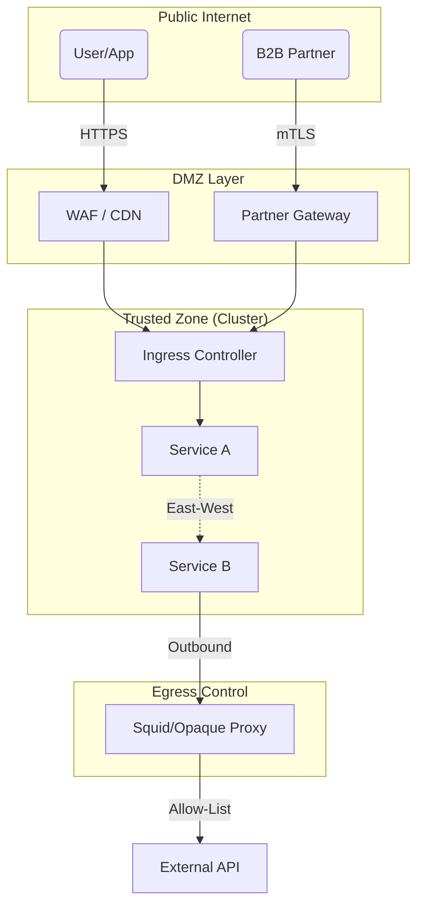

# Network Security Architecture (Firewall & Proxy)

## 1. Network Zones & Trust Boundaries

*   **Public Zone (Untrusted):** The internet. Source of all evil.
*   **DMZ / Edge (Semi-Trusted):** Where WAFs and Load Balancers live. Terminates public TLS.
*   **App Zone (Trusted):** Where microservices run. Ingress only from DMZ or Internal.
*   **Data Zone (High Security):** Databases. Ingress only from specific App subnets.

## 2. Firewall Patterns

### A. North-South (B2C Inbound)
*   **Control:** WAF (Web Application Firewall).
*   **Policy:** Rate Limit by IP, Block Bad Bots, Geo-Blocking (optional).
*   **Flow:** Internet -> CDN -> WAF -> Ingress Gateway.

### B. Partner Inbound (B2B)
*   **Control:** Mutual TLS (mTLS) Gateway.
*   **Policy:**
    *   **IP Allow-list:** Only accept traffic from Partner's static IPs.
    *   **Cert Validation:** Strict SNI and Client Cert chain check.
*   **Flow:** Partner -> B2B Gateway -> Internal Service.

### C. East-West (Internal)
*   **Control:** Kubernetes NetworkPolicies + Service Mesh.
*   **Policy:** Deny All by default. Allow specific Service-to-Service paths.

### D. Outbound (Egress)
*   **Control:** Egress Proxy (Squid / Azure Firewall / AWS Network Firewall).
*   **Policy:**
    *   **Allow-List:** Only allow traffic to known domains (e.g., `api.stripe.com`, `*.googleapis.com`).
    *   **Deny:** Block all other outbound traffic (prevents C2 malware usage).

## 3. Proxy Usage Diagram

---

Copyright 2026 Chaitanya Bharath Gopu. Licensed under the Apache License, Version 2.0.
