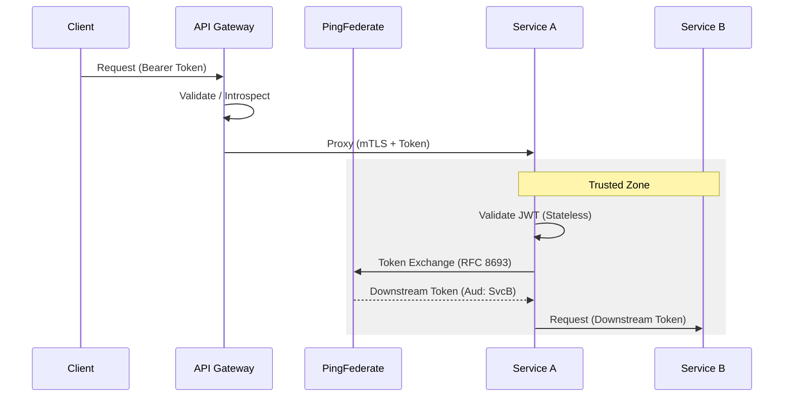

# Security Reference Patterns

## 1. Zero Trust & Identity (PingFederate)

CNMRF adopts a **Zero Trust** postulate: "Never trust, always verify."

*   **Trust Boundary:** All network traffic is untrusted.
*   **Identity Source:** PingFederate (providing OIDC/OAuth2).
*   **Access Control:** Role-Based (RBAC) or Attribute-Based (ABAC).

### Integration Pattern: OIDC & Token Exchange



### Configuration Snippets

**Spring Boot (Security Config)**
```java
// SecurityFilterChain configuration
http.oauth2ResourceServer(oauth2 -> oauth2
    .jwt(jwt -> jwt.decoder(jwtDecoder()))
);

// Token Exchange (using WebClient)
public String exchangeToken(String subjectToken) {
    // Call PingFed /as/token.oauth2 with grant_type=urn:ietf:params:oauth:grant-type:token-exchange
}
```

**.NET (Program.cs)**
```csharp
// Add Auth Services
builder.Services.AddAuthentication(JwtBearerDefaults.AuthenticationScheme)
    .AddJwtBearer(options => {
        options.Authority = "https://pingfed.example.com";
        options.Audience = "api://cnmrf-service";
        options.TokenValidationParameters = new TokenValidationParameters {
             ValidateIssuer = true,
             ValidateAudience = true
        };
    });
```

## 2. mTLS (Mutual TLS)

**Intent:** Encrypt traffic in transit and cryptographically verify service identity.

*   **Option A (Service Mesh):** Istio/Linkerd handles mTLS transparently via sidecars. Preferred for k8s.
*   **Option B (Framework Level):** Configure KeyStore/TrustStore in app. Used for legacy/VM workloads.

## 3. Secrets Management

**Rule:** No secrets in source code.
1.  **Vault / Secret Store:** Secrets injected at runtime.
2.  **Environment Variables:** App consumes secrets as env vars mapped from K8s Secrets.

---

Copyright 2026 Chaitanya Bharath Gopu. Licensed under the Apache License, Version 2.0.
